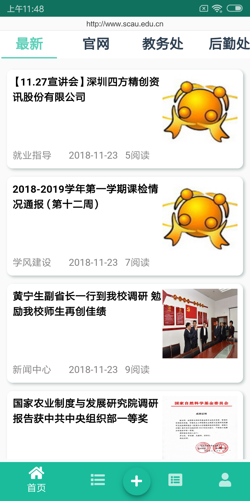
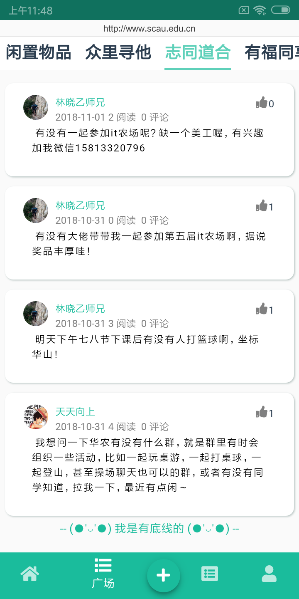
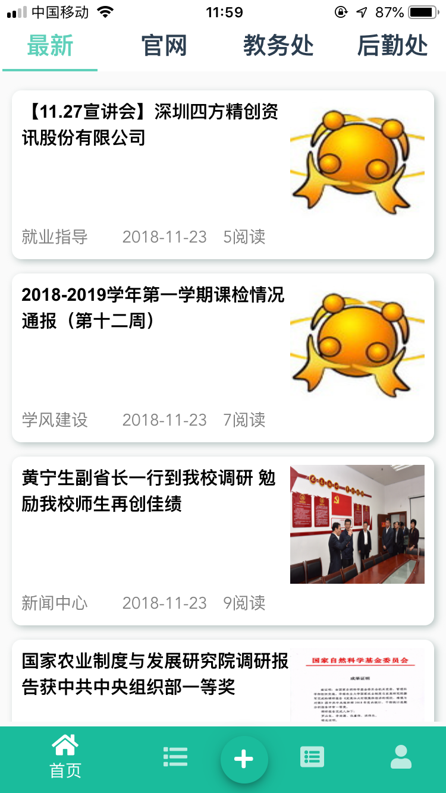
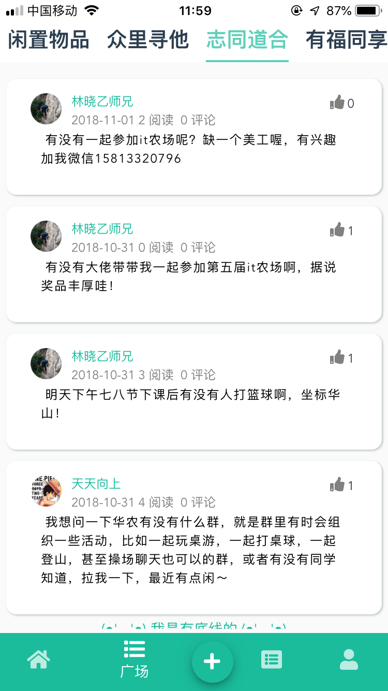

### 华农圈
**首页模块**是通过爬虫爬取学校各教学教辅单位官网发布的信息，然后在移动端展示，方便师生快速获取最新发布的信息。

**广场模块**是学生经常会用到的信息模块，如闲置物品，失物招领等，这里没有做社交模块，用户可选择自己合适的社交方式与他人联系和沟通。

另外引入**易班登陆**,一定程度保证用户发布信息的真实有效性。

### 部分截图 (其他请看screenshot)
- Andriod

- IOS

### 协议
MIT